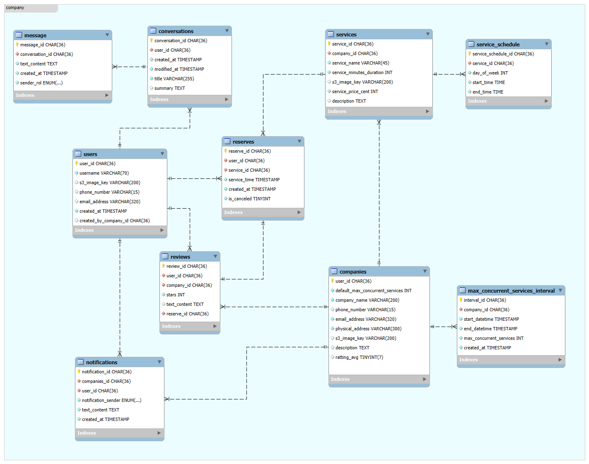

# Database Schema

Este directorio contiene los scripts y el modelo de la base de datos del proyecto.

## Archivos principales

- `reserves_init_pg.sql` - Script PostgreSQL de creación de esquema `reserves`.
- `reserves_mysql_original.sql` - Script MySQL original generado por MySQL Workbench.
- `reserves_complete_v1.mwb` - Modelo de MySQL Workbench.
- `diagram.png` - Diagrama visual del esquema de la base de datos.

## Diagrama visual

## Esquema `reserves`

### Tipos ENUM
- `sender_rol`: `USER`, `SYSTEM`
- `notification_sender`: `USER`, `COMPANY`

### Tablas

1. `users`
   - `user_id` UUID PK
   - `s3_image_key` VARCHAR(200)
   - `phone_number` VARCHAR(15)
   - `email_address` VARCHAR(320)
   - `created_at` TIMESTAMP
   - `created_by_company_id` UUID

2. `companies`
   - `user_id` UUID PK
   - `default_max_concurrent_services` INT
   - `company_name` VARCHAR(200)
   - `phone_number` VARCHAR(15)
   - `email_address` VARCHAR(320)
   - `physical_address` VARCHAR(300)
   - `s3_image_key` VARCHAR(200)
   - `description` TEXT
   - `ratting_avg` SMALLINT

3. `services`
   - `service_id` UUID PK
   - `company_id` UUID FK → `companies(user_id)`
   - `service_name` VARCHAR(45)
   - `service_minutes_duration` INT
   - `s3_image_key` VARCHAR(200)
   - `service_price_cent` INT
   - `description` TEXT

4. `reserves`
   - `reserve_id` UUID PK
   - `user_id` UUID FK → `users(user_id)`
   - `service_id` UUID FK → `services(service_id)`
   - `service_time` TIMESTAMP
   - `created_at` TIMESTAMP
   - `is_canceled` BOOLEAN

5. `conversations`
   - `conversation_id` UUID PK
   - `user_id` UUID FK → `users(user_id)`
   - `created_at` TIMESTAMP
   - `modified_at` TIMESTAMP
   - `title` VARCHAR(255)
   - `summary` TEXT

6. `message`
   - `message_id` UUID PK
   - `conversation_id` UUID FK → `conversations(conversation_id)`
   - `text_content` TEXT
   - `created_at` TIMESTAMP
   - `sender_rol` `sender_rol`

7. `notifications`
   - `notification_id` UUID PK
   - `companies_id` UUID FK → `companies(user_id)`
   - `user_id` UUID FK → `users(user_id)`
   - `notification_sender` `notification_sender`
   - `text_content` TEXT
   - `created_at` TIMESTAMP

8. `max_concurrent_services_interval`
   - `interval_id` UUID PK
   - `company_id` UUID FK → `companies(user_id)`
   - `start_datetime` TIMESTAMP
   - `end_datetime` TIMESTAMP
   - `max_concurrent_services` INT
   - `created_at` TIMESTAMP

9. `service_schedule`
   - `service_schedule_id` UUID PK
   - `service_id` UUID FK → `services(service_id)`
   - `day_of_week` INT
   - `start_time` TIME
   - `end_time` TIME

10. `reviews`
    - `review_id` UUID PK
    - `user_id` UUID FK → `users(user_id)`
    - `company_id` UUID FK → `companies(user_id)`
    - `stars` INT
    - `text_content` TEXT
    - `reserve_id` UUID FK → `reserves(reserve_id)`

## Relaciones clave

- `services.company_id` → `companies.user_id`
- `reserves.user_id` → `users.user_id`
- `reserves.service_id` → `services.service_id`
- `conversations.user_id` → `users.user_id`
- `message.conversation_id` → `conversations.conversation_id`
- `notifications.companies_id` → `companies.user_id`
- `notifications.user_id` → `users.user_id`
- `max_concurrent_services_interval.company_id` → `companies.user_id`
- `service_schedule.service_id` → `services.service_id`
- `reviews.user_id` → `users.user_id`
- `reviews.company_id` → `companies.user_id`
- `reviews.reserve_id` → `reserves.reserve_id`